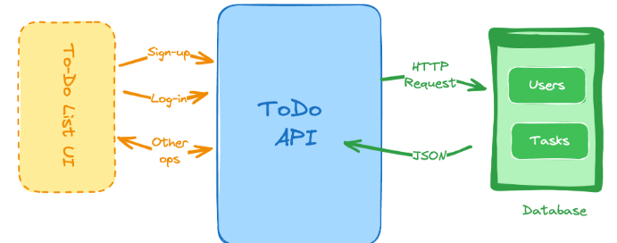

# TODO-api: Task Management Backend

TODO-api is part of a **20-backend project challenge** aimed at creating a scalable and efficient backend API for managing tasks. Built using **NestJS** and **Prisma**, this API allows users to create, retrieve, update, and delete tasks while using JWT authentication to secure task-related routes. It demonstrates best practices in API development with proper error handling and a clean, modular architecture.

## Key Features

- **Create a task**: Users can create new tasks with details like title, content, and status.
- **Get all tasks**: Retrieve a list of all tasks with the option to filter by their status.
- **Get a task by ID**: Fetch details for a specific task.
- **Update a task**: Modify an existing task.
- **Delete a task**: Remove a task from the database.

## Technologies Used

- **NestJS**: A progressive Node.js framework for building efficient, scalable server-side applications.
- **Prisma ORM**: Database management and interaction toolkit for Node.js, integrated with PostgreSQL.
- **JWT Authentication**: Provides security for routes, ensuring only authorized users can create, update, or delete tasks.
- **PostgreSQL**: The relational database used with Prisma for task storage and retrieval.

## Endpoints

### 1. Get All Tasks

This endpoint retrieves all tasks. You can optionally filter tasks by their completion status.

- **Route**: `GET /task`
- **Query Parameter**: `status` (boolean) – Pass true or false to filter tasks by status.

Example:

````bash
GET /task?status=true
```json
[
  {
    "id": 1,
    "title": "Learn NestJS",
    "content": "Study the basics of NestJS framework",
    "status": true,
    "authorId": 2
  },
  ...
]

````

```bash
POST /task/create
```

```json
{
  "title": "Learning Auth",
  "content": "Learnt access and refresh token",
  "status": false
}
```

```bash
POST /task/create
```

### Request Body:

```json
{
  "title": "Learning Auth",
  "content": "Learnt access and refresh token",
  "status": false
}
```

### Response Body:

```json
{
  "message": "Task created successfully",
  "payload": {
    "id": 1,
    "title": "Learning Auth",
    "content": "Learnt access and refresh token",
    "status": false,
    "authorId": 2
  }
}
```



## Credits

This project idea is taken from [roadmap.sh](https://roadmap.sh/projects/todo-list-api).

